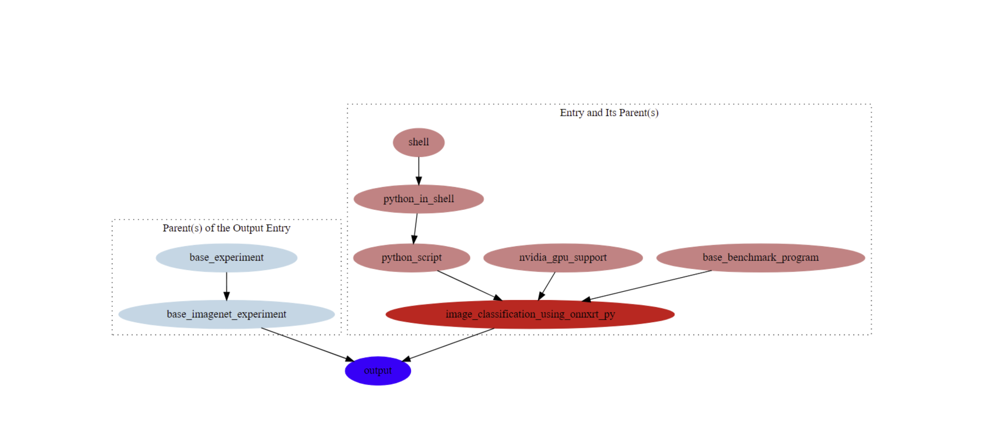

## Generating Hierarchy Graph
Set the target entry that we would like to draw a dependency graph for, e.g., image_classification_using_tf_py
```
export TARGET=image_classification_using_tf_py
```
`AXS` command to generate the graph:
```
axs byquery graph_output,target=${TARGET}
```

The figure shows a dependency graph generated for `image_classification_using_tf_py` entry. 

- Red : target entry 
- Lightcoral: Parents of the target entry
- Blue: output node
- Lightblue: Parents of the output node

If the run is successful, it should print `Graph is generated!`
```
saved to '/home/saheli/work_collection/generated_by_graph_on_draw_a579763d98044530962cc967ac659b28/data_axs.json'
byname_entries: ['base_imagenet_experiment']
Graph is generated!
['^', 'byname', 'generated_by_graph_on_draw_generated_by_graph_on_draw_a579763d98044530962cc967ac659b28']
```
The image of the graph rendered in vector graphics, `image.svg` and `.dot` file are generated under `axs byquery graph_output,target=${target} , get_path`. Open `image.svg` with a GUI interface to view the generated graph. 

The structure of the `.dot` file will look something like this: `image`. It can be interpreted as a normal text file.
```
digraph {
        node [shape=ellipse]
        dpi=400
        subgraph cluster_0 {
                style=dotted
                label="Entry and Its Parent(s)"
                image_classification_using_tf_py [color=red style=filled]
                python_script -> image_classification_using_tf_py
                base_benchmark_program -> image_classification_using_tf_py
                base_benchmark_program [color=lightcoral style=filled]
                python_script [color=lightcoral style=filled]
                python_in_shell -> python_script
                python_in_shell [color=lightcoral style=filled]
                shell -> python_in_shell
                shell [color=lightcoral style=filled]
        }
        output [color=blue style=filled]
        image_classification_using_tf_py -> output
        base_imagenet_experiment -> output
        subgraph cluster_1 {
                style=dotted
                label="Parent(s) of the Output Entry"
                base_imagenet_experiment [color=lightblue style=filled]
                base_experiment -> base_imagenet_experiment
                base_experiment [color=lightblue style=filled]
        }
}
```
## Running tests
The next step is to run the tests.

### Step 1:
The first step is to run the `create_json.py` to generate two json files containing dictionaries containing all the contained entries obtained as keys from `bert`, `image_classification`, `object_detection` folders and corresponding values as the `_parent_entries`  and `output_parent_entries` for each entry.
```
python create_json.py
```
<Details><Pre>
output_parent_entries_dict.json  parent_entries_dict.json  </Details></Pre>

### Step 2:
Next, to run the `test_parent_and_output_entries.py` file 
```
pytest test_parent_and_output_entries.py
```
<Details><Pre>
==================================================================================== 2 passed in 0.01s =====================================================================================
collected 2 items

test_parent_and_output_entries.py::test_compare_dot_and_json_for_target PASSED
test_parent_and_output_entries.py::test_compare_dot_and_json_for_target_output PASSED
 </Details></Pre>